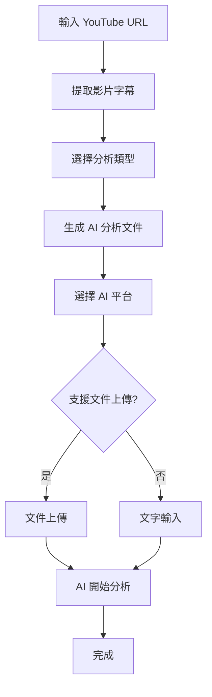

# YouTube to AI 自動化系統 (文件上傳版)

## 📌 系統概述

這是一個增強版的 YouTube 影片文字提取和 AI 分析自動化系統。主要改進是**使用文件上傳**代替逐字輸入，大幅提高效率和穩定性。

## 🚀 主要功能

### 1. YouTube 文字提取

- 自動提取 YouTube 影片字幕
- 支援多種語言（中文、英文等）
- 智慧文字清理和格式化
- 自動錯誤修正

### 2. AI 分析文件生成

- 根據不同分析類型生成對應的 Prompt
- 包含完整影片資訊和文字稿
- 支援多種分析模式：
  - 📝 **內容摘要** - 重點整理和要點提取
  - 🔍 **深度分析** - 邏輯結構和論證分析
  - ❓ **問題生成** - 理解性和應用性問題
  - 🌐 **翻譯優化** - 多語言翻譯和內容優化
  - 🧠 **心智圖結構** - 概念關聯和學習路徑
  - 📊 **歷史數據驗證** - 事實核查和可信度評估
  - 📈 **趨勢分析預測** - 識別趨勢和發展預測
  - 🚀 **未來預測分析** - 多情境建模和策略建議
  - 🏢 **行業洞察分析** - 專業市場和投資分析
  - ✅ **事實核查報告** - 系統性資訊驗證

### 3. AI 平台自動上傳

- **ChatGPT** - 支援文件上傳 ✅
- **Claude** - 支援文件上傳 ✅
- **Google Gemini** - 支援文件上傳 ✅
- **Grok (X.AI)** - 文字輸入模式 📝
- **Perplexity AI** - 文字輸入模式 📝

### 4. 智能文件管理

- **自動清理** - 文件成功上傳後強制自動刪除 🗑️
- **智能保留** - 處理失敗時保留文件以便重試 📁
- **安全刪除** - 只刪除 ai_uploads 目錄下的 .txt 文件 🔒
- **磁盤優化** - 自動維持乾淨整潔的工作環境 ✨

## 🔧 安裝要求

```bash
# 必要套件
pip install youtube-transcript-api google-api-python-client selenium webdriver-manager psutil
```

## 📁 檔案結構

```
youtube2Text/
├── youtube_text_extractor.py    # YouTube 文字提取器
├── youtube_text_2_AI.py         # AI 自動發送器 (文件上傳版)
├── quick_test.py                # 快速測試腳本
├── enhanced_prompt_demo.py      # 增強版 Prompt 功能演示
├── README.md                    # 說明文件
├── requirements.txt             # 套件依賴
├── setup.py                     # 自動安裝腳本
└── ai_uploads/                  # 生成的 AI 文件目錄
    ├── {video_id}_summary_*.txt
    ├── {video_id}_analysis_*.txt
    ├── {video_id}_historical_verification_*.txt
    ├── {video_id}_trend_analysis_*.txt
    ├── {video_id}_future_prediction_*.txt
    └── ...
```

## 🎯 使用方式

### 主要使用方法 (推薦)

```bash
python youtube_text_2_AI.py
```

**完整自動化流程：**

1. 輸入 YouTube 影片 URL
2. 選擇分析類型 (摘要/分析/問題/翻譯/心智圖等)
3. 自動提取文字並生成 AI 文件
4. 選擇要上傳的 AI 平台
5. 自動上傳並清理文件

### 快速測試

```bash
python quick_test.py
```

提供快速測試功能：

- 完整流程測試
- 示例文件創建
- 文件上傳測試

### 高級功能演示

```bash
python enhanced_prompt_demo.py
```

展示所有高級分析功能：

- 🎯 所有 Prompt 類型概覽和詳細說明
- 📁 批量創建不同分析類型的文件
- 🎨 自定義分析組合功能
- 📋 Prompt 模板內容查看和保存
- 🔍 歷史驗證、趨勢分析、未來預測功能展示

## 🌟 新增高級功能

### 歷史數據驗證分析

- 對比影片內容與歷史數據
- 評估資訊的可信度等級
- 識別可能的偏見或錯誤
- 提供權威資料來源建議

### 趨勢分析與預測

- 識別當前和歷史趨勢模式
- 分析驅動因素和影響範圍
- 預測短中長期發展方向
- 評估機會與風險因素

### 未來預測分析

- 多情境建模 (樂觀/基準/悲觀)
- 時間線預測和關鍵節點
- 不確定性分析和監測指標
- 策略建議和行動計劃

### 行業洞察分析

- 專業投資者角度解析
- 市場環境和競爭格局評估
- 商業模式和盈利點分析
- 投資建議和風險評估

### 事實核查報告

- 系統性聲明識別和分類
- 多重來源交叉驗證
- 可信度評級和證據評估
- 更正建議和權威來源

## 📋 生成文件格式

系統會生成結構化的文字文件，包含：

```
影片標題：{影片標題}
影片 ID：{影片ID}
影片 URL：https://www.youtube.com/watch?v={影片ID}
============================================================

AI 分析 Prompt (summary)：
----------------------------------------
請幫我總結這個 YouTube 影片的內容：

請提供：
1. 主要內容摘要（3-5 個重點）
2. 關鍵觀點或論述
3. 實用建議或結論
4. 適合的目標受眾

請用繁體中文回覆。

============================================================

YouTube 影片完整文字稿：
----------------------------------------
{完整的影片文字稿內容}
```

## 🔄 工作流程



## ⚡ 效能優勢

### 文件上傳 vs 文字輸入對比

| 特性         | 文件上傳    | 文字輸入    |
| ------------ | ----------- | ----------- |
| **速度**     | ⚡ 即時上傳 | 🐌 逐字輸入 |
| **穩定性**   | ✅ 高穩定   | ⚠️ 易中斷   |
| **文字長度** | 📄 無限制   | 📝 有限制   |
| **錯誤率**   | ✅ 極低     | ⚠️ 較高     |
| **用戶體驗** | 😊 無需等待 | 😴 需要等待 |
| **文件管理** | 🗑️ 自動清理 | 📁 手動管理 |

## 🛠️ 進階設定

### 1. YouTube API 設定 (可選)

```python
# 在 youtube_text_extractor.py 中設定
extractor = YouTubeTextExtractor(api_key="YOUR_YOUTUBE_API_KEY")
```

### 2. Chrome 調試模式

系統會自動檢測並啟動 Chrome 調試模式，如果需要手動啟動：

```bash
# Windows
chrome.exe --remote-debugging-port=9222 --user-data-dir=chrome_debug_profile

# macOS
/Applications/Google\ Chrome.app/Contents/MacOS/Google\ Chrome --remote-debugging-port=9222 --user-data-dir=chrome_debug_profile

# Linux
google-chrome --remote-debugging-port=9222 --user-data-dir=chrome_debug_profile
```

## 🐛 常見問題

### 1. Chrome 連接失敗

- 確保 Chrome 瀏覽器已安裝
- 檢查是否有其他程序佔用調試端口
- 嘗試重新啟動 Chrome

### 2. 找不到文件上傳按鈕

- 確保 AI 網站已完全載入
- 檢查是否需要登入 AI 平台
- 某些 AI 平台可能不支援文件上傳

### 3. 影片沒有字幕

- 檢查影片是否有自動生成字幕
- 嘗試不同語言的字幕
- 考慮使用其他有字幕的影片

### 4. 文件自動刪除相關

- **文件被意外刪除**: 系統只會在成功上傳後才刪除文件
- **系統行為**: 文件上傳成功後會自動清理，無需用戶操作
- **安全性考量**: 系統只會刪除 ai_uploads 目錄下的 .txt 文件
- **重新處理文件**: 如果需要重新上傳，請重新運行 YouTube 提取流程
- **失敗保護**: 所有 AI 平台都處理失敗時，文件會自動保留

## 📊 支援的 AI 平台

| AI 平台    | 文件上傳 | 文字輸入 | 狀態     |
| ---------- | -------- | -------- | -------- |
| ChatGPT    | ✅       | ✅       | 完全支援 |
| Claude     | ✅       | ✅       | 完全支援 |
| Gemini     | ✅       | ✅       | 完全支援 |
| Grok       | ❌       | ✅       | 部分支援 |
| Perplexity | ❌       | ✅       | 部分支援 |

## 🔮 未來改進

- [ ] 支援更多 AI 平台
- [ ] 批次處理多個影片
- [ ] 自動分析結果收集
- [ ] GUI 圖形化介面
- [ ] 影片摘要比較功能
- [ ] 自動標籤和分類

## 📄 授權

本專案採用 MIT 授權條款。

## 🤝 貢獻

歡迎提交 Issue 和 Pull Request 來改進這個專案！

---

**💡 提示**: 使用文件上傳功能時，請確保已登入對應的 AI 平台，且瀏覽器允許文件上傳操作。
